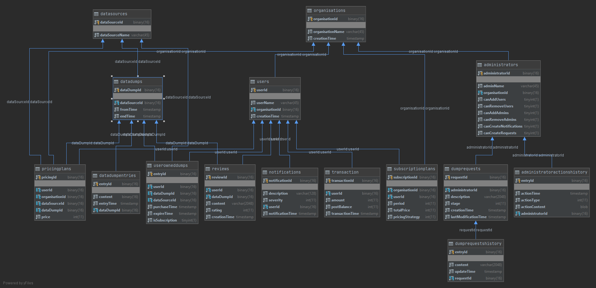

# KNU_2023_BD_lab1

This project contains functions for first lab on databases cource. 

Загальна ідея – існує застосунок, який продає дампи даних з різних платформ – всі твіти за деякий час, всі коментарі в ютубі під деяким типом відео і так далі. Для цієї системи є користувачі, які належать до організацій, та адміністратори організацій. Ціна доступу до даних регулюється тим, до якої організації належить користувач, або може створюватися особистий план. 

Пояснення таблиць 

Users – користувач, який може купляти дані. 

Organizations – організації, до яких належать користувачі (сгрупований спосіб створювати ціни). 

Adminstrators – адмін організації, має права створювати нових користувачів, створювати повідомлення, та запрашувати нові дампи. 

Datasource – сорс даних, може бути вебсайтом, або вебсайт-пошуковим запитом тд

Datadumps – мінімальний об’єм даних, які можна купити. 

DataDumpEntry – один рядок/коментар з дататампу. 

PricingPlans – прайсинг план для або датадампу, або цілого сорсу файлів, аналогічно або для юзера або для цілої організації. 

SubscriptionPlan – план підписки на якийсь датасорс (спосіб не купляти план назавжди, а підписуватися на нього) 

DumpRequests – запит від адміністратора на створення новго плану

DumpRequestsHistory – історія одного реквесту, яка зберігає зміни і їх час. 

AdministratorActionHistory  - історія дій з адміністраторами – зміна прав, створення нових 

Notification – оповіщення користувачів про важливі зміни тд

UserOwnedDumps – таблиця, яка вказує що користувач володіє дампом

Reviews – відгук користувача про дамп

Transaction – дія користувача, яка вимагає гроші – депозит, або купівля, або можливо комісія в майбутньому. 

